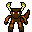

### Minotaur 
Un labyrinthe 2D pixel auquel il vous faut survivre.

Votre combat avec Thésée s'est mal terminé. Vous devez maintenant vous échapper. Ne ragez pas. Et sachez que vous n'y parviendrez pas.

 
Personnage principal que vous jouez.

Contrôles : ◀️🔼🔽▶️, barre espace pour lancer et Q pour quitter.

Vous pouvez télécharger dans les releases de cette page github ou directement en cliquant [ici](https://github.com/Najinc/Minotaur/releases)

## INSTALLATION :

> - Télécharger le ZIP comme énoncé ci-dessus.
> - Décompresser le dossier.
> - Ouvrir le dossier Minotaur et exécuter **Minotaur.exe**.